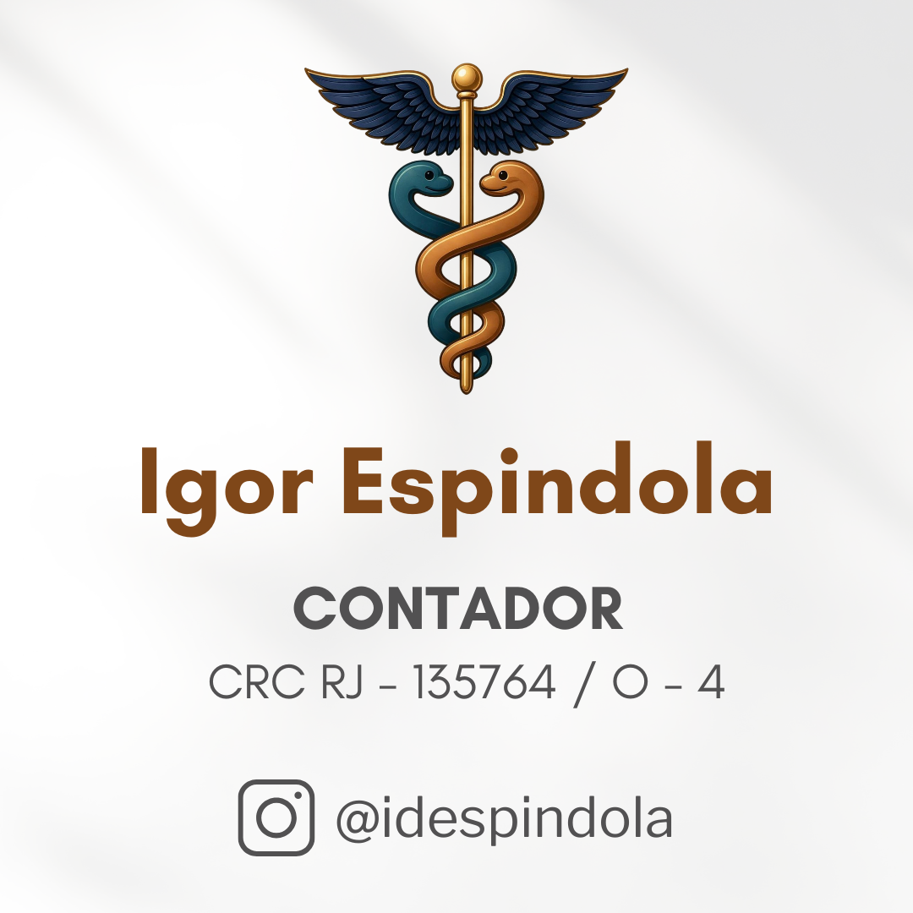

::: {.content-block}
::: {.profile}
::: {.profile-logo}
{fig-alt="Marca Igor Espindola Contador"}
:::

::: {.profile-copy}
Sobre mim

# Fiscal, contador e fundador da IDESPINDOLA SISTEMAS

Sou Igor da Silva Espindola, contador registrado no CRC-RJ, Fiscal de Tributos Municipal em Miracema/RJ, professor de formação e fundador da IDESPINDOLA SISTEMAS. Atuo desde 2011 no setor público, com foco em gestão tributária municipal, fiscalização de ISS, análise de dados, automação de rotinas e construção de sistemas especialistas.

Minha formação passa por Matemática na UFF, Ciências Contábeis na UFRJ e especialização em Direito Tributário. Essa combinação moldou meu jeito de trabalhar: rigor técnico, leitura jurídica cuidadosa e vontade de transformar processos complexos em sistemas mais simples.
:::
:::
:::

::: {.band}
::: {.content-block}
::: {.section-heading}
## Minha forma de trabalhar

Gosto de resolver problemas reais, especialmente aqueles que ficam escondidos em planilhas, sistemas isolados, dados mal aproveitados e rotinas que consomem tempo demais.
:::

::: {.grid .three}
::: {.card}
### Dados antes de achismo

Quando há base disponível, a decisão precisa ser sustentada por evidência, rastreabilidade e critério técnico.
:::

::: {.card}
### Código como ferramenta

Programação, para mim, é uma extensão da contabilidade e da fiscalização: serve para automatizar, conferir, comparar, documentar e transformar conhecimento técnico em sistemas úteis.
:::

::: {.card}
### Serviço público moderno

Tenho interesse especial por transformação digital, integração entre órgãos, transparência e melhoria da experiência do cidadão.
:::

::: {.card}
### Experiência docente

Já atuei como Professor de Matemática no Ensino Médio e como monitor na UFF, experiências que reforçaram meu interesse por didática, tecnologia e resolução de problemas.
:::
:::
:::
:::

::: {.content-block .compact}
::: {.quote}
Também gosto de viver fora da tela: café, viagens, momentos em família e a ideia simples de trabalhar bem sem esquecer o que dá sentido ao trabalho.
:::
:::

::: {.content-block}
::: {.section-heading}
## Formação e atuação
:::

::: {.timeline}
::: {.timeline-item}
### Fiscal de Tributos Municipal

Atuação em fiscalização, análise tributária, projetos de modernização e atendimento técnico ligado à administração tributária municipal.
:::

::: {.timeline-item}
### Fundador da IDESPINDOLA SISTEMAS

Iniciativa voltada à construção de sistemas especialistas, automações e soluções técnicas para rotinas contábeis, fiscais e tributárias.
:::

::: {.timeline-item}
### Presidente do Comitê Gestor do SEI

Presidência do [Comitê Gestor do SEI de Miracema](https://miracema.rj.gov.br/sei), com atuação na implantação, governança e melhoria do processo administrativo eletrônico no município.
:::

::: {.timeline-item}
### Contador CRC-RJ 135764/O-4

Atuação contábil com ênfase em gestão fiscal, regularização, Simples Nacional, MEI, autônomos e organização financeira.
:::

::: {.timeline-item}
### Representante técnico indicado pela CNM

Servidor municipal indicado pela Confederação Nacional dos Municípios, conforme norma da Receita Federal, para atuação técnica junto ao Simples Nacional: [consulta externa da norma](https://normasinternet2.receita.fazenda.gov.br/#/consulta/externa/151509).
:::

::: {.timeline-item}
### Matemática, Contabilidade e Direito Tributário

Formação multidisciplinar voltada a problemas em que números, normas e sistemas precisam conversar.
:::

::: {.timeline-item}
### Professor de Matemática e monitor na UFF

Atuação como Professor de Matemática no Ensino Médio pela SEEDUC-RJ em 2022, lotado no Instituto de Educação de Miracema, além de monitorias na Universidade Federal Fluminense em 2011 e 2012. Fonte pública: [perfil acadêmico no Escavador](https://www.escavador.com/sobre/4914054/igor-da-silva-espindola).
:::
:::

::: {.link-row}
[<i class="bi bi-envelope"></i> Email](mailto:igorespindola91@gmail.com){.button .light}
[<i class="bi bi-instagram"></i> Instagram](https://www.instagram.com/idespindola){.button .light}
:::
:::
