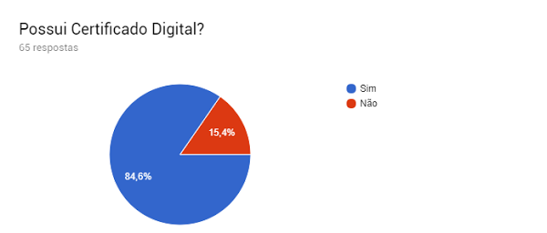
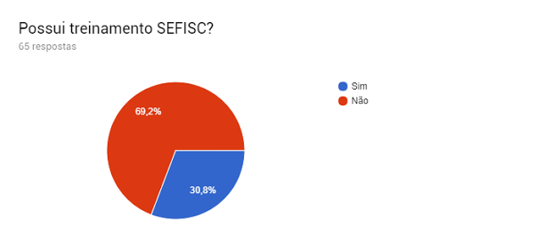

# **SEFISC NA PRÁTICA**

Blog criado a partir do grupo de [whatsapp](https://chat.whatsapp.com/CY77JEvhrqRF1V8mlbgRZh).

----------

Contribua com a pesquisa [aqui](https://goo.gl/forms/xusRDZXFe5dYaQFN2).

----------
## **BANCO DE QUESTÕES**

### **Exclusão de Ofício**

**1 -** Não localizei o dispositivo na [LC 123/2006](http://www.planalto.gov.br/ccivil_03/leis/LCP/Lcp123.htm) que seja correspondente ao contido no Art. 75, §7º, e Art. 76, inciso III, alínea a, da [Resolução CGSN 94/2011](http://normas.receita.fazenda.gov.br/sijut2consulta/link.action?idAto=36833&visao=anotado). Quais dispositivos da Lei autorizam a Resolução firmar tal regramento?

> A autorização para que o CGSN regulamente as questões do SN, incluído aí, a Exclusão, vide o Art. 2°, inciso I e §6º, da LC 123/2006. *Lembre-se tudo que for do SN, se a LC 123/2006 não mencionou, vale o que está regulamentado pelas Resoluções*. (Ritsutada Takara)

----------
## **LEGISLAÇÃO**

### Leis

[Constituição Federal](http://www.planalto.gov.br/ccivil_03/constituicao/constituicao.htm)

[Lei 5.172/1966 - CTN](http://www.planalto.gov.br/ccivil_03/leis/L5172.htm)

[Lei Complementar 116/2003](http://www.planalto.gov.br/ccivil_03/leis/LCP/Lcp116.htm)

[Lei Complementar 123/2006](http://www.planalto.gov.br/ccivil_03/leis/LCP/Lcp123.htm)

### Resoluções CGSN

[Resolução CGSN 94/2011](http://normas.receita.fazenda.gov.br/sijut2consulta/link.action?idAto=36833&visao=anotado)

----------
## **MANUAIS DO SEFISC**

[MANUAL DE INTRODUÇÃO](../sefisc/arquivos/intro-sefisc-v1.0.1.pdf)

[MANUAL DO REGISTRO DA AÇÃO FISCAL](../sefisc/arquivos/raf-sefisc-v3.1.pdf)

[MANUAL DO AINF](../sefisc/arquivos/ainf-sefic-v3.1)

[MANUAL DO CONTENCIOSO DO AINF](../sefisc/arquivos/contencioso-sefisc-v3.0.pdf)

----------
## **NOTAS TÉCNICAS - CNM**

[Certificado Digital e a Importância para os Municípios.](../sefisc/arquivos/nt-01-2017-certificado-digital.pdf)

[SEFISC - O que os municípios precisam saber?](../sefisc/arquivos/nt-04-2016-sefisc.pdf)

[Simples Nacional: Convênio com a Procuradoria Geral da Fazenda Nacional (PGFN)](../sefisc/arquivos/nt-01-2016-convenio.pdf)