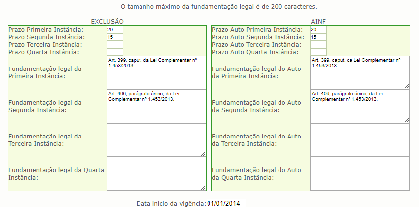

# **SEFISC NA PRÁTICA**

Blog criado a partir do grupo de [whatsapp](https://chat.whatsapp.com/CY77JEvhrqRF1V8mlbgRZh).

----------

Contribua com a pesquisa [aqui](https://goo.gl/forms/xusRDZXFe5dYaQFN2).

----------
## **BANCO DE QUESTÕES**

### **Cadastro de Prazos de Contestação**

**1 -** No momento de geração do AINF apareceu a seguinte mensagem: **"Favor contactar o gestor das tabelas de domínio para realizar o devido cadastramento"**.

> Observar o seguinte:
>
>> a) a gestora das tabelas de domínio é a RFB (vide [Manual de Introdução ao SEFISC](../sefisc/arquivos/intro-sefisc-v1.0.1.pdf), pág. 6);
>>
>> b) enviar detalhes do ocorrido (inclusive print da tela da mensagem de erro) para o e-mail: simples08.sefisc@receita.fazenda.gov.br
>
> Exemplo de preenchimento:
>
>> 

### **Exclusão de Ofício**

**1 -** Não localizei o dispositivo na [LC 123/2006](http://www.planalto.gov.br/ccivil_03/leis/LCP/Lcp123.htm) que seja correspondente ao contido no Art. 75, §7º, e Art. 76, inciso III, alínea a, da [Resolução CGSN 94/2011](http://normas.receita.fazenda.gov.br/sijut2consulta/link.action?idAto=36833&visao=anotado). Quais dispositivos da Lei autorizam a Resolução firmar tais regramentos?

> A autorização para que o CGSN regulamente as questões do SN, incluído aí, a Exclusão, vide o Art. 2°, inciso I e §6º, da LC 123/2006. *Lembre-se tudo que for do SN, se a LC 123/2006 não mencionou, vale o que está regulamentado pelas Resoluções*. (Ritsutada Takara)

----------
## **LEGISLAÇÃO**

### Leis

[Constituição Federal](http://www.planalto.gov.br/ccivil_03/constituicao/constituicao.htm)

[Lei 5.172/1966 - CTN](http://www.planalto.gov.br/ccivil_03/leis/L5172.htm)

[Lei Complementar 116/2003](http://www.planalto.gov.br/ccivil_03/leis/LCP/Lcp116.htm)

[Lei Complementar 123/2006](http://www.planalto.gov.br/ccivil_03/leis/LCP/Lcp123.htm)

### Resoluções CGSN

[Resolução CGSN 94/2011](http://normas.receita.fazenda.gov.br/sijut2consulta/link.action?idAto=36833&visao=anotado)

----------
## **MANUAIS DO SEFISC**

[Manual de Introdução](../sefisc/arquivos/intro-sefisc-v1.0.1.pdf)

[Manual do Registro da Ação Fiscal](../sefisc/arquivos/raf-sefisc-v3.1.pdf)

[Manual do AINF](../sefisc/arquivos/ainf-sefic-v3.1)

[Manual do Contencioso do AINF](../sefisc/arquivos/contencioso-sefisc-v3.0.pdf)

----------
## **NOTAS TÉCNICAS - CNM**

[Simples Nacional: Convênio com a Procuradoria Geral da Fazenda Nacional (PGFN).](../sefisc/arquivos/nt-01-2016-convenio.pdf)

[SEFISC - O que os municípios precisam saber?](../sefisc/arquivos/nt-04-2016-sefisc.pdf)

[Certificado Digital e a Importância para os Municípios.](../sefisc/arquivos/nt-01-2017-certificado-digital.pdf)

### **Desenquadramento do MEI**

Art. 18-A, § 8º, da Lei Complementar nº 123/2006.

> § 8º  O desenquadramento de ofício dar-se-á quando verificada a falta de comunicação de que trata o § 7º deste artigo.

>>§ 7º  O desenquadramento mediante comunicação do MEI à Secretaria da Receita Federal do Brasil - RFB dar-se-á:
>>
>> I - por opção, que deverá ser efetuada no início do ano-calendário, na forma disciplinada pelo Comitê Gestor, produzindo efeitos a partir de 1º de janeiro do ano-calendário da comunicação;
>>
>> II - obrigatoriamente, quando o MEI incorrer em alguma das situações previstas no § 4º deste artigo, devendo a comunicação ser efetuada até o último dia útil do mês subseqüente àquele em que ocorrida a situação de vedação, produzindo efeitos a partir do mês subseqüente ao da ocorrência da situação impeditiva;
>>>
>>> § 4º  Não poderá optar pela sistemática de recolhimento prevista no caput deste artigo o MEI:  
>>>
>>> I - cuja atividade seja tributada na forma dos Anexos V ou VI desta Lei Complementar, salvo autorização relativa a exercício de atividade isolada na forma regulamentada pelo CGSN;
>>>
>>> II - que possua mais de um estabelecimento;
>>>
>>> III - que participe de outra empresa como titular, sócio ou administrador; ou
>>> 
>>> IV - que contrate mais de um empregado.
>>>
>> III - obrigatoriamente, quando o MEI exceder, no ano-calendário, o limite de receita bruta previsto no § 1º deste artigo, devendo a comunicação ser efetuada até o último dia útil do mês subseqüente àquele em que ocorrido o excesso, produzindo efeitos:
>>>
>>> § 1º  Para os efeitos desta Lei Complementar, considera-se MEI o empresário individual que se enquadre na definição do art. 966 da Lei nº 10.406, de 10 de janeiro de 2002 - Código Civil, ou o empreendedor que exerça as atividades de industrialização, comercialização e prestação de serviços no âmbito rural, que tenha auferido receita bruta, no ano-calendário anterior, de até R$ 81.000,00 (oitenta e um mil reais), que seja optante pelo Simples Nacional e que não esteja impedido de optar pela sistemática prevista neste artigo.
>>>
>> a) a partir de 1º de janeiro do ano-calendário subseqüente ao da ocorrência do excesso, na hipótese de não ter ultrapassado o referido limite em mais de 20% (vinte por cento);
>>
>> b) retroativamente a 1º de janeiro do ano-calendário da ocorrência do excesso, na hipótese de ter ultrapassado o referido limite em mais de 20% (vinte por cento);
>>
>> IV - obrigatoriamente, quando o MEI exceder o limite de receita bruta previsto no § 2º deste artigo, devendo a comunicação ser efetuada até o último dia útil do mês subseqüente àquele em que ocorrido o excesso, produzindo efeitos:
>>>
>>> § 2º  No caso de início de atividades, o limite de que trata o § 1o será de R$ 6.750,00 (seis mil, setecentos e cinquenta reais) multiplicados pelo número de meses compreendido entre o início da atividade e o final do respectivo ano-calendário, consideradas as frações de meses como um mês inteiro. 
>>>
>> a) a partir de 1º de janeiro do ano-calendário subseqüente ao da ocorrência do excesso, na hipótese de não ter ultrapassado o referido limite em mais de 20% (vinte por cento);
>>
>> b) retroativamente ao início de atividade, na hipótese de ter ultrapassado o referido limite em mais de 20% (vinte por cento).

**§ 9º  O Empresário Individual desenquadrado da sistemática de recolhimento prevista no caput deste artigo passará a recolher os tributos devidos pela regra geral do Simples Nacional a partir da data de início dos efeitos do desenquadramento, ressalvado o disposto no §10 deste artigo.**

**§ 10.  Nas hipóteses previstas nas alíneas a dos incisos III e IV do § 7º deste artigo, o MEI deverá recolher a diferença, sem acréscimos, em parcela única, juntamente com a da apuração do mês de janeiro do ano-calendário subseqüente ao do excesso, na forma a ser estabelecida em ato do Comitê Gestor.**

**3 -** Como deve ser lançado os excessos apurados, na hipótese de não ter ultrapassado o limite em mais de 20% (vinte por cento)?

> O lançamento da diferença deverá ser realizado no Sistema Próprio do Ente.