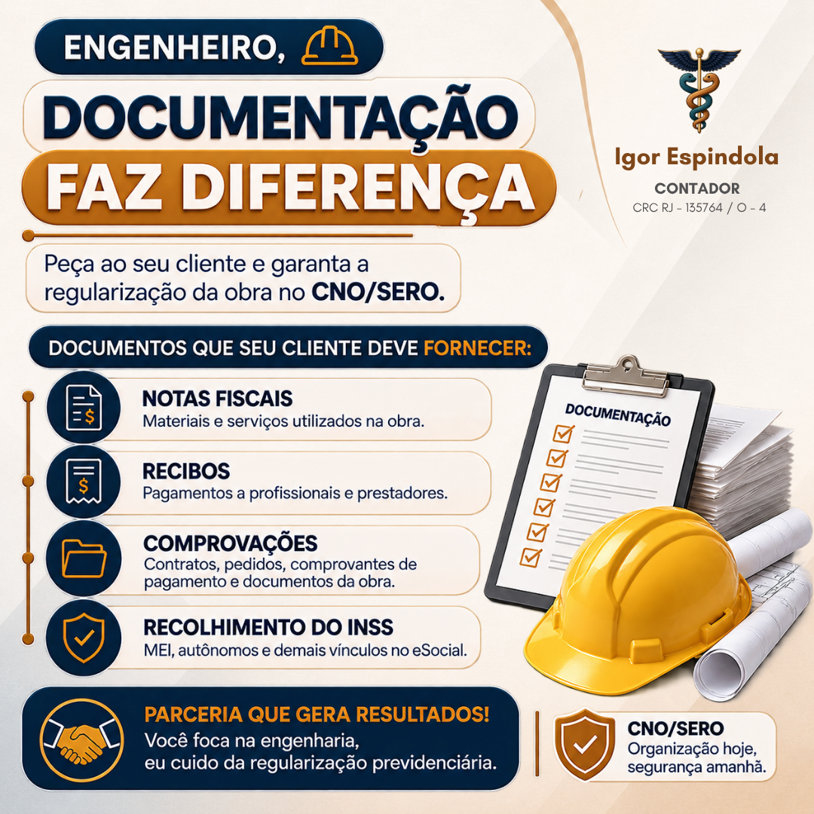
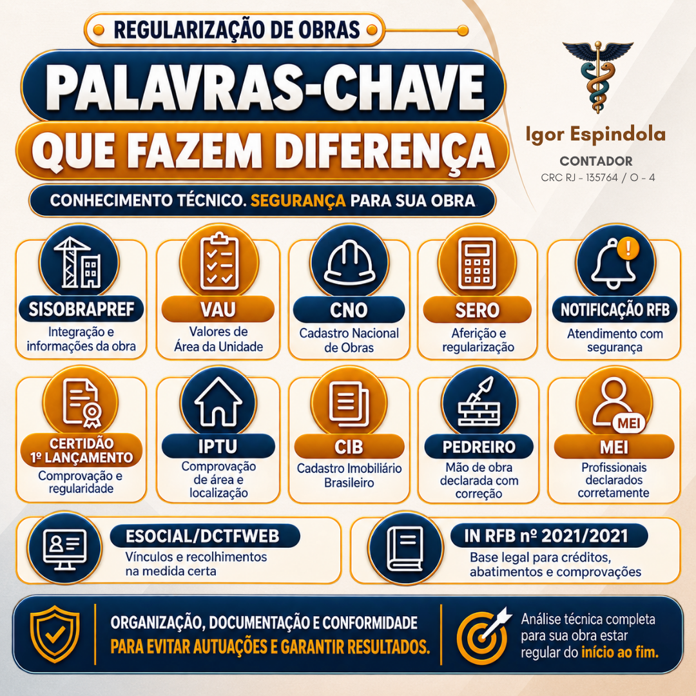
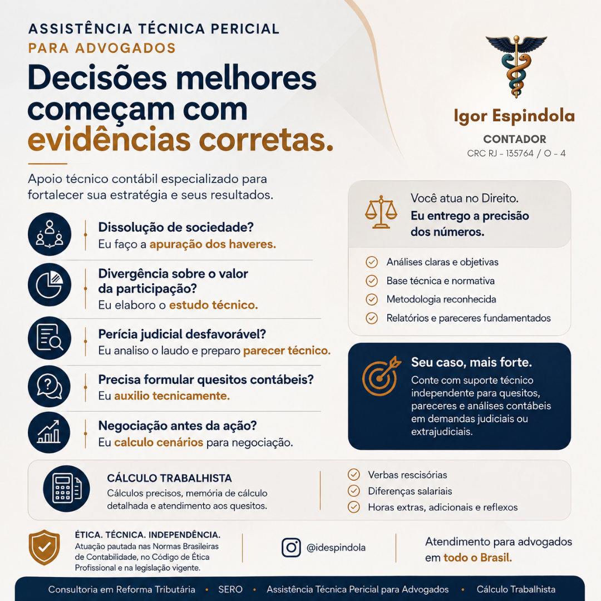

::: {.content-block}
Serviços

# Soluções técnicas em tributação, perícia e regularização

Atendimento para empresas, advogados, contadores e pessoas físicas que precisam de análise clara, documentação bem organizada e decisões baseadas em evidências. Pela IDESPINDOLA SISTEMAS, uno contabilidade, tributação, tecnologia e orientação objetiva.
:::

::: {.band}
::: {.content-block}
::: {.section-heading}
## Parcerias técnicas

Atuação ao lado de profissionais que precisam entregar segurança documental, cálculos bem fundamentados e leitura técnica independente.
:::

::: {.partnership-feature}
::: {.partnership-copy}
### CNO/SERO para engenheiros e proprietários

Você cuida da engenharia. Eu cuido da regularização previdenciária da obra, com organização documental, conferência de informações e acompanhamento técnico do início ao fim.

<ul class="tag-list">
  <li>CNO</li>
  <li>SERO</li>
  <li>SISOBRAPREF</li>
  <li>VAU</li>
  <li>Notificações RFB</li>
  <li>eSocial/DCTFWeb</li>
</ul>

[Ver proposta técnica](arquivos/Parceria-Tecnica-CNO-SERO.pdf){.button .primary}
[Lista de documentos](arquivos/Lista-Documentos-Comprovacao-CNO-SERO.pdf){.button .light}
:::

::: {.partnership-media}
{fig-alt="Parceria técnica CNO/SERO para regularização de obras"}
:::
:::

::: {.grid .two .partnership-grid}
::: {.card}
### Documentação faz diferença

Notas fiscais, recibos, comprovantes, contratos, recolhimentos e informações da obra precisam conversar entre si. A parceria técnica reduz risco de autuações e dá previsibilidade ao processo.
:::

::: {.card}
### Segurança na regularização

Organização, documentação e conformidade para evitar autuações e sustentar a regularidade da obra perante a Receita Federal.
:::
:::

::: {.image-strip}
{fig-alt="Documentos necessários para regularização CNO/SERO"}
{fig-alt="Palavras-chave da regularização de obras"}
:::

::: {.partnership-feature .reverse}
::: {.partnership-copy}
### Assistência técnica pericial para advogados

Você atua no Direito. Eu entrego a precisão dos números. A parceria técnica dá suporte independente para quesitos, pareceres e análises contábeis em demandas judiciais ou extrajudiciais.

- Apuração de haveres em dissolução de sociedade.
- Estudo técnico sobre divergência de valores ou participação societária.
- Análise de laudo pericial desfavorável e preparação de parecer técnico.
- Formulação de quesitos contábeis.
- Cálculo de cenários para negociação antes da ação.
- Cálculo trabalhista com memória detalhada e atendimento aos quesitos.

<ul class="tag-list">
  <li>Apuração de haveres</li>
  <li>Parecer técnico</li>
  <li>Quesitos contábeis</li>
  <li>Cálculo trabalhista</li>
  <li>Cenários de negociação</li>
</ul>
:::

::: {.partnership-media}
{fig-alt="Assistência técnica pericial para advogados"}
:::
:::
:::
:::

::: {.content-block}
::: {.section-heading}
## Frentes principais

Serviços pensados para resolver problemas fiscais, patrimoniais e contábeis com método, documentação e linguagem direta.
:::

::: {.grid .three}
::: {.card}
### Reforma tributária

Consultoria para entender impactos, reorganizar rotinas, revisar enquadramentos e preparar empresas para mudanças nas regras de consumo, documentos fiscais e apuração.
:::

::: {.card}
### CNO e SERO

Regularização de obras junto à Receita Federal, com cadastro no CNO, aferição no SERO, análise documental e estudo de decadência tributária quando cabível.
:::

::: {.card}
### Compliance e autorregularização

Apoio à organização de dados, preparação de notificações, cruzamentos fiscais e acompanhamento de ações de conformidade e autorregularização.
:::
:::
:::

::: {.content-block}
::: {.section-heading}
## Contabilidade e negócios
:::

::: {.grid .three}
::: {.card}
### Abertura de empresa

Análise do melhor caminho para formalizar o negócio, escolha do regime tributário, viabilidade, CNPJ, inscrições necessárias e alvará.
:::

::: {.card}
### Contabilidade mensal

Escrituração, apuração de tributos, obrigações acessórias, demonstrações contábeis, relatórios e acompanhamento fiscal para empresas do Simples Nacional.
:::

::: {.card}
### Gestão financeira

Organização de notas, conciliação bancária, fluxo de caixa, separação entre finanças pessoais e empresariais e leitura dos números para decisão.
:::
:::
:::

::: {.band}
::: {.content-block}
::: {.section-heading}
## Regularização e proteção
:::

::: {.grid .two}
::: {.card}
### MEI, autônomos e pessoa física

Regularização, parcelamentos, credenciamento para emissão de notas, Carnê-Leão, Livro-Caixa, IRPF, ganho de capital e análise de pendências.
:::

::: {.card}
### NFS-e, sistemas e automação

Apoio em rotinas de NFS-e Nacional, TRANSFARQ do Simples Nacional, ADN, CNC, Emissor Nacional, DTE-SN, conferência de dados, integrações, cruzamentos fiscais e automações com Python para tarefas contábeis e tributárias.
:::

::: {.card}
### Marca, software e inovação

Orientação para proteger marcas, programas de computador e ativos intelectuais, com organização documental e acompanhamento do caminho adequado.
:::

::: {.card}
### Regularização patrimonial

Leitura técnica de documentos, valores, imóveis, obrigações e registros para apoiar decisões administrativas, contábeis ou judiciais.
:::
:::
:::
:::

::: {.content-block .compact}
::: {.section-heading}
## Vamos conversar?

Me conte o que você precisa organizar, provar, calcular ou regularizar. A partir disso, eu avalio o cenário e proponho o melhor caminho.
:::

[<i class="bi bi-envelope"></i> Email](mailto:igorespindola91@gmail.com){.button .primary}
[<i class="bi bi-instagram"></i> Instagram](https://www.instagram.com/idespindola){.button .light}
:::
